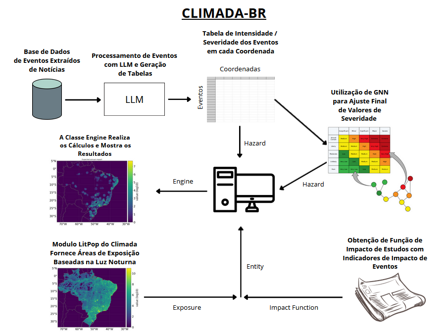
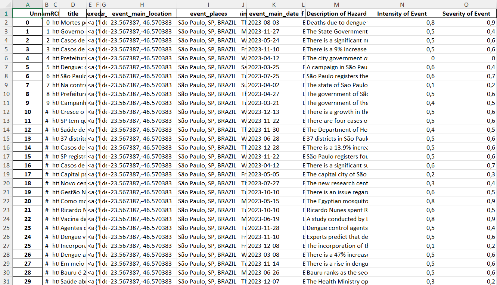
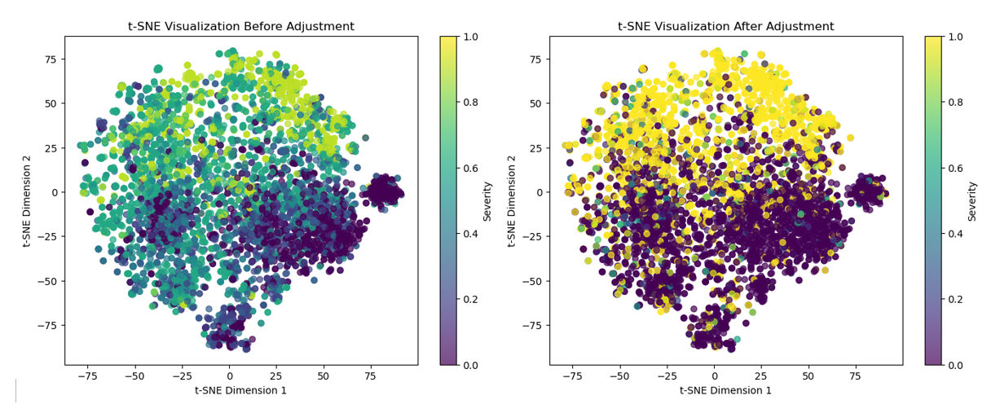
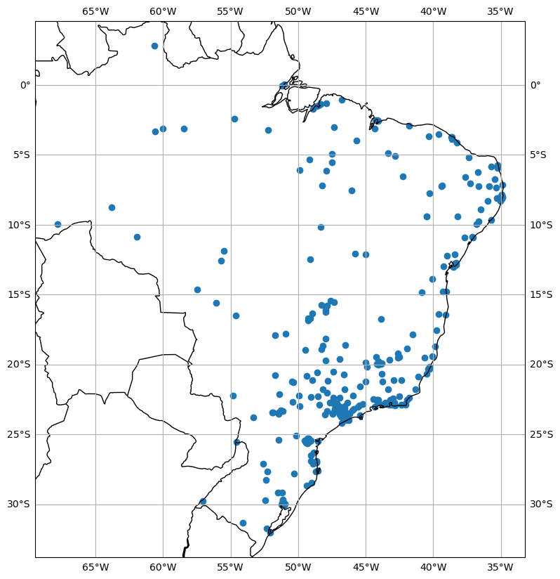
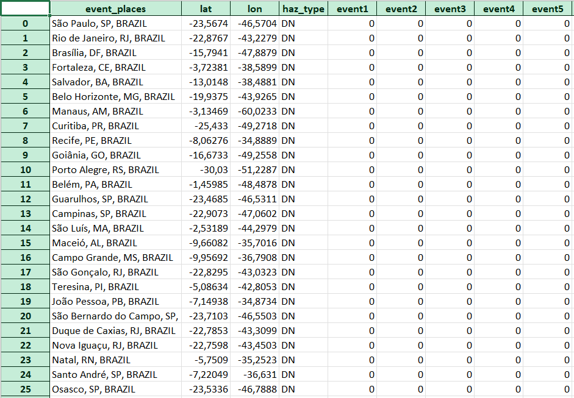
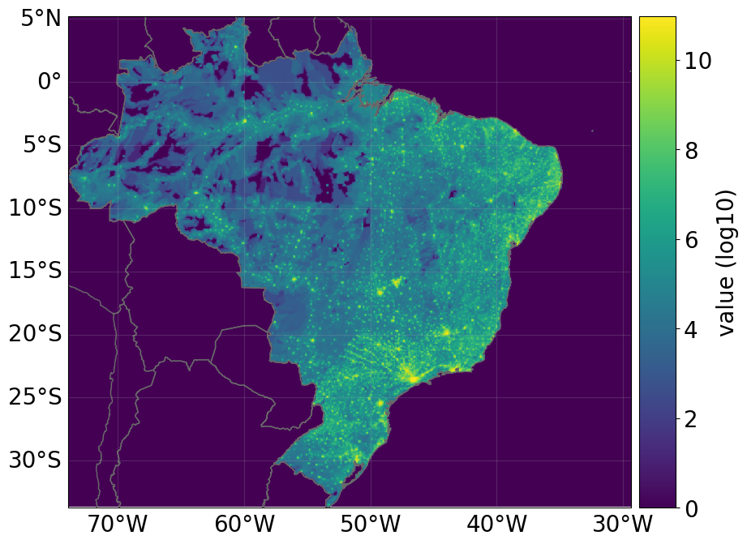
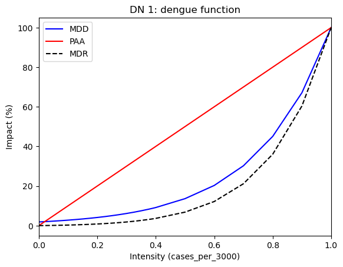
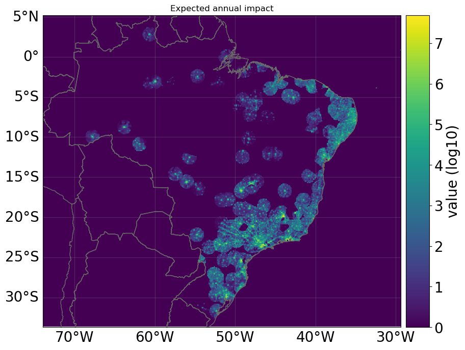

# CLIMADA-BR

Climada-BR is a project of LABIC (Laboratory of Computational Intelligence from USP São Carlos), that seeks to improve hazard assesment in Brazil using LLM's (Large Language Models) for extracting event data from auternative sources. **This repository is a fork from the original [CLIMADA](https://github.com/CLIMADA-project/climada_python) which stands for CLIMate ADAptation and is a probabilistic natural catastrophe impact model**, that also calculates averted damage (benefit) thanks to adaptation measures of any kind (from grey to green infrastructure, behavioural, etc.). The installation Guide is at the end of the page.

## Introduction

Our proposal addresses the challenge of improving hazard assessment by extracting event data from alternative sources to enhance risk analysis and climate adaptation in Brazil. Hazards, dynamic events, or circumstances that can cause harm, play a significant role as crucial input parameters in modeling the impact of climatic events. For example, changes in weather patterns or the detection of invasive vector species exemplify hazards that significantly influence these models.

Hazards are fundamental for calibrating models, acting as key parameters to better understand the risks associated with climate change impacts. In this context, [CLIMADA](https://github.com/CLIMADA-project/) model, short for CLIMate ADAptation, serves as a probabilistic natural catastrophe impact model, encompassing the evaluation of averted damage (benefit) resulting from diverse adaptation measures, ranging from grey to green infrastructure and behavioral adaptations [1]. With these models, public managers and researchers can conduct risk analyses, taking into account the effects of climatic events based on local data. This enables the formulation of preventive plans and awareness strategies. Presently, CLIMADA offers historical and probabilistic event sets for various time horizons, spanning past, present, and future climates. However, CLIMADA faces limitations when directly applied to the Brazilian context. These limitations stem from a scarcity of local data and the intricate regional complexities present in Brazil.

The overarching idea of the CLIMADA-BR proposal is to develop an open-source software tailored for Brazilian decision-makers. This software aims to act as a facilitating tool for community participation and crowd-sourcing data collection. By enabling the extraction of hazards from diverse local sources, such as news, bulletins, and reports from public managers, CLIMADA-BR strives to facilitate comprehensive climate risk modeling. This, in turn, enhances decision-making processes and fosters community involvement in tracking climate change impacts at the local level.

## Proposal Information

Currently, CLIMADA is the first global platform for probabilistic multi-hazard risk modeling, incorporating uncertainty and sensitivity analyses. This model enables the assessment of natural hazard risks and the evaluation of adaptation options by comparing averted impacts to implementation costs. Hazard, in CLIMADA, is modeled as a probabilistic set of events, each representing intensity at geographical locations with an associated probability of occurrence. The risk of a single event is defined as its impact multiplied by its probability of occurrence. CLIMADA allows for globally consistent risk assessment from city to continental scale, considering historical data, future projections, and various adaptation options.

Our proposal is straightforward and has a direct impact on public managers, researchers, and stakeholders interested in monitoring and understanding the impact of climate change in impoverished regions. We propose extending the model to CLIMADA-BR, integrating Large Language Models (LLMs) for real-time hazard extraction from news, bulletins, and reports. This adaptation will significantly enhance the model's sensitivity to localized climate events, resulting in improved risk assessments for various societal sectors. The idea is to leverage significant advancements in LLMs to enrich the model's hazard database.

Our hypothesis is that the integration of Large Language Models (LLMs) into the CLIMADA-BR framework enhances the capacity to collect, classify, and extract hazards. This integration aims to provide a more accurate representation of climate impacts on a local scale, considering diverse regions in Brazil.

The LLMs employed will extract hazard events in the 5W1H format (what, where, when, who, why, and how), an area where the project coordinator already has expertise, particularly in climate change events [2,3]. To assess the software's performance, we will conduct experiments on events modeling variables related to the detection of invasive vector species and disease transmission dynamics, providing insights for public officials to make informed decisions regarding public health impacts.

This project's development involves two Ph.D. students under the coordinator's supervision, who are currently engaged in the creation of artificial intelligence models for event extraction and sensing. These students bring valuable expertise to the initiative, contributing to the advancement of the project's objectives.

## Path to impact

First, we will conduct rigorous testing and validation of the CLIMADA-BR model, refining its functionalities based on feedback and real-world data. Simultaneously, we will collaborate with key stakeholders, including government agencies, public health institutions, and environmental organizations, to ensure the model's alignment with their needs. We will leverage existing collaborations with stakeholders such as the Center for Artificial Intelligence in Brazil ([C4AI](https://c4ai.inova.usp.br/research_2/#Climate_B_eng)), IBM, and FAPESP to ensure widespread implementation and impactful utilization of CLIMADA-BR in addressing climate-related hazards.

Once validated, the CLIMADA-BR framework will be disseminated through workshops, training sessions, and online platforms, targeting decision-makers, researchers, and the public. An open-source release of the model will be pivotal to encourage broader adoption and continuous improvement. To maximize the project's impact, we will establish partnerships with local communities, leveraging their knowledge and contributing to the model's enrichment.

## Description of the Climada-BR Modules

The `ClimadaBR` class encompasses the entire process of data storage, processing, and result generation through its methods. When instantiated, two required attributes must be provided: the name of the file containing the *hazard* data (generated by an LLM) and the name of the file with the *impact function* (created based on studies that relate event intensity to resulting impacts). In addition to these, various secondary parameters can be provided to configure the data processing.

To illustrate, we present results obtained from two files: one containing data on dengue, processed by an LLM based on news articles on the topic, and another with the impact function based on a FIEMG study, which correlated the number of dengue cases with economic losses — whether due to treatments or labor absences.



### Hazard

The *Hazard* module stores the data of the analyzed climate phenomena. In Climada-BR, interaction with this module occurs mainly during object instantiation or via methods such as `ClimadaBR.Set_Hazard`.

In the case of dengue data extracted from 2023 news by an LLM, the format adopted was a table, with rows representing events and columns containing coordinates, dates, descriptions, severity, and intensity:



These tables are processed to extract and organize the relevant information. Optionally, an additional step can be performed: adjustment using a GNN (Graph Neural Network), more specifically a GCN (Graph Convolutional Network). The GCN is trained with events of extreme severity (very high or very low), using event description encodings as *features* and severity values (1 for high, 0 for low) as *labels*. After training, the model assigns severity to the remaining events, increasing data consistency — since the LLM, by classifying events in isolation, may produce inconsistencies in some cases.

The impact of this adjustment can be visualized using methods such as `ClimadaBR.Plot_HazReg`, which shows the changes in severity values:



After the *Hazard* information is stored, additional methods can be used to inspect this data, such as `ClimadaBR.Plot_Haz_Centroids`, which displays the coordinates of each event:



And `ClimadaBR.Dataframe_Print`, which shows the structure of the stored data, with rows representing locations and columns containing values such as latitude, longitude, and intensity of each event at those coordinates (noting that most intensity values are zero, since each event affects few locations, and the table contains 302 locations):



### Entity

The *Entity* module consists of two main components: *Exposure* and *Impact Function*.

#### Exposure

The *Exposure* module stores information about areas affected by the climate phenomenon, and can represent various parameters such as population, GDP, among others. In Climada-BR, we used an existing method from CLIMADA that utilizes the file `gpw_v4_population_count_rev11_2020_30_sec.tif`, which models global population distribution in cells of approximately 1 km. The parameters used were: country = Brazil, grid = 300 arc-seconds, and socioeconomic value = `'income_group'`, where `'income_group'` represents GDP multiplied by the country’s income group (income group values range from 1 to 4, with 1 being low and 4 being high).

The exposure data can be visualized using the method `ClimadaBR.Plot_Exposure`:



#### Impact Function

The *Impact Function* correlates event intensity with PAA (Percentage of Affected Assets) and MDD (Mean Degree of Damage). This function is defined by several points that represent this relationship. In our project, it was constructed to approximate the results of a dataset obtained from DATASUS, referring to the first five months of 2023, with the financial damage values proposed by a FIEMG study, which linked 4.2 million dengue cases to an economic impact of R$ 20.3 billion. In the context of the project, our goal was to adapt the impact function to yield an estimated impact of approximately 900 million USD, a value corresponding to the number of infected individuals represented by the DATASUS data.

We then applied this function, previously adapted to the DATASUS dataset, to the data derived from the LLM’s analysis of news reports. If the resulting values do not significantly deviate from expectations — as was the case — this indicates both the effectiveness of the project and the validity of the proposed impact function. The *Impact Function* is passed to the `ClimadaBR` object either during instantiation or via the method `ClimadaBR.Set_ImpFun`; in both cases, the name of a file containing a table is provided, with columns representing Intensity, PAA, and MDD.

To visualize the function, the method `ClimadaBR.Plot_ImpFun` is used, which generates the following chart. The MDR (Mean Damage Rate) value is obtained by multiplying MDD by PAA:



### Engine

The *Engine* module, or *Impact* (in the original CLIMADA, *Engine* includes several submodules; in Climada-BR, however, it was restricted to only the *Impact* module, hence the terms are treated as equivalent), differs from the others in that it stores calculation results rather than input data. It is defined via the method `ClimadaBR.ComputeImpact`, which uses the data previously stored in the other modules to generate an impact object. Upon creation, this object automatically performs the necessary calculations to determine various impact indicators. Using the method `ClimadaBR.Results`, the output includes a chart similar to the one below, along with textual results. For the dataset used, the `aai_agg` (Average Annual Impact) property was approximately 1.1 billion USD, representing the average annual impact:



## Updates

### Minimalistic Example

At [CLIMADA-BR/doc/tutorial/TUTORIAL_BASE_CLIMADA_BR.ipynb](https://github.com/Labic-ICMC-USP/CLIMADA-BR/blob/main/doc/tutorial/TUTORIAL_BASE_CLIMADA_BR.ipynb) we have a minimalistic example of how CLIMADA works through our ClimadaBR Class. You can also check Climada's official tutorials to learn more, you can start with [CLIMADA-BR/doc/tutorial/1_main_climada.ipynb](https://github.com/Labic-ICMC-USP/CLIMADA-BR/blob/main/doc/tutorial/1_main_climada.ipynb).

To run every ClimadaBR tutorial in your machine you need to follow the installation guide below and also download the [gpw_v4_population_count_rev11_2020_30_sec.tif](https://drive.google.com/uc?id=1-3Skg9WOBDq8AyFV_WIdVsFDXG40qKCv&confirm=t&uuid=19db6326-d640-4af6-8fbf-51e7e479a338). This folder, along with some other files that are in the [CLIMADA-BR/doc/ClimadaBR_docs](https://github.com/Labic-ICMC-USP/CLIMADA-BR/blob/main/doc/ClimadaBR_docs) folder, need to be put in the SYSTEM_DIR of climada. Check out this README file [CLIMADA-BR/doc/ClimadaBR_docs/README.md](https://github.com/Labic-ICMC-USP/CLIMADA-BR/blob/main/doc/ClimadaBR_docs/README.md) to do it correctly.

### Climada-BR Class

At CLIMADA-BR/climada/ we have our class climadaBR which encapsulates the main functions used on our project, climadaBR has 5 python files: an 'init.py', 'climadaBR_def.py' (where the user can define the climadaBR object and interact with it), 'file_conversor.py' (which takes an file and organizes the data into a dataframe that can be passed to Climada to define a hazard), hazardRegularization.py (contain the process of using a GCN to regularize part of the data of some hazard file) and utils.py (which has some non excential tools used in the project).

The main functions a user will need to use climada are:

- ClimadaBR(haz_file, impctFunc_file, regulated, use_severity_threshold, severity_threshold, by_month_only, max_month, exp_lp, impf_set, haz): object creation, haz_file and impactFunc_file are the only necessary parameters, the rest is additional.
- ClimadaBR.Results(): to see the results of the Climada calculation.
- ClimadaBR.Plot_Exposure(): to see the Exposure used in the calculation.
- ClimadaBR.Plot_Haz_Centroids(): to see the centroids, which are the locations where our groups of events happened.
- ClimadaBR.Plot_ImpFun(): to see the impact function used.
- ClimadaBR.haz_reg.Results_Plots(): to see the changes made to the severity values by using a GCN to better classify the events.

This tutorial can show you how to use each of them [CLIMADA-BR/doc/tutorial/Tutorial_ClimadaBR.ipynb](https://github.com/Labic-ICMC-USP/CLIMADA-BR/blob/main/doc/tutorial/Tutorial_ClimadaBR.ipynb).

If you want to see the other functions you can see the python files or our other tutorials to learn about them, but they are probably not necessary for you to use the application.

### DENGUE Hazard

In our project we thought of expanding the climate analysis function of Climada into a tool to analyse other types of events, in this case deseases and epydemics. So for our project we used dengue data from Brazil to compute the economic impact in a year, see this tutorial to have a full understanding of how we did that and which studies we took as base for our project [CLIMADA-BR/doc/tutorial/Tutorial_Dengue.ipynb](https://github.com/Labic-ICMC-USP/CLIMADA-BR/blob/main/doc/tutorial/Tutorial_Dengue.ipynb).
  
## Installation Guide

### Prerequisites

* Make sure you are using the **latest version** of your OS. Install any outstanding **updates**.
* Free up at least 10 GB of **free storage space** on your machine.
  Anaconda and the CLIMADA dependencies will require around 5 GB of free space, and you will need at least that much additional space for storing the input and output data of CLIMADA.
* Ensure a **stable internet connection** for the installation procedure.
  All dependencies will be downloaded from the internet.
  Do **not** use a metered, mobile connection!
* Install `Anaconda`, following the [installation instructions](https://docs.anaconda.com/anaconda/install/) for your OS.

### Instructions

1. If you are using a **Linux** OS, make sure you have ``git`` installed
   (Windows and macOS users are good to go once Anaconda is installed).
   On Ubuntu and Debian, you may use APT:
   
```
      apt update
      apt install git
```

   Both commands will probably require administrator rights, which can be enabled by prepending ``sudo``.

2. Create a **workspace directory**.
   To make sure that your user can manipulate it without special privileges, use a subdirectory of your user/home directory.
   Do **not** use a directory that is synchronized by cloud storage systems like OneDrive, iCloud or Polybox!

3. Open the command line and navigate to the workspace directory you created using ``cd``.
   Replace ``<path/to/workspace>`` with the path of the directory that contains the workspace folder:

```
      cd <path/to/workspace>
```

4. Clone CLIMADA-BR from its [GitHub repository](https://github.com/Labic-ICMC-USP/CLIMADA-BR.git).
   Enter the directory and check out the branch of your choice.

```
      git clone https://github.com/Labic-ICMC-USP/CLIMADA-BR.git
```

5. Create an Anaconda environment called ``climada_env`` for installing CLIMADA.
   Use the default environment specs in ``env_climada.yml`` to create it.
   Then activate the environment:

```
      conda env create -n climada_env -f requirements/env_climada.yml
      conda activate climada_env
```

6. Install the local CLIMADA source files as Python package using ``pip``:

```
      python -m pip install -e ./
```

hint:: Using a path ``./`` (referring to the path you are currently located at) will instruct ``pip`` to install the local files instead of downloading the module from the internet.
      The ``-e`` (for "editable") option further instructs ``pip`` to link to the source files instead of copying them during installation.
      This means that any changes to the source files will have immediate effects in your environment, and re-installing the module is never required.

7. Verify that everything is installed correctly by executing a single test:

```
      python -m unittest climada.engine.test.test_impact
```

   Executing CLIMADA for the first time will take some time because it will generate a directory tree in your home/user directory.
   If this test passes, great!
   You are good to go.


## References

[1] KROPF, Chahan M. et al. Uncertainty and sensitivity analysis for probabilistic weather and climate-risk modelling: an implementation in CLIMADA v. 3.1. 0. Geoscientific Model Development, v. 15, n. 18, p. 7177-7201, 2022.

[2] GÔLO, Marcos Paulo Silva; ROSSI, Rafael Geraldeli; MARCACINI, Ricardo Marcondes. Learning to sense from events via semantic variational autoencoder. Plos one, v. 16, n. 12, p. e0260701, 2021.

[3] MATTOS, Joao Pedro Rodrigues; MARCACINI, Ricardo M. Semi-supervised graph attention networks for event representation learning. In: 2021 IEEE International Conference on Data Mining (ICDM). IEEE, 2021. p. 1234-1239.
